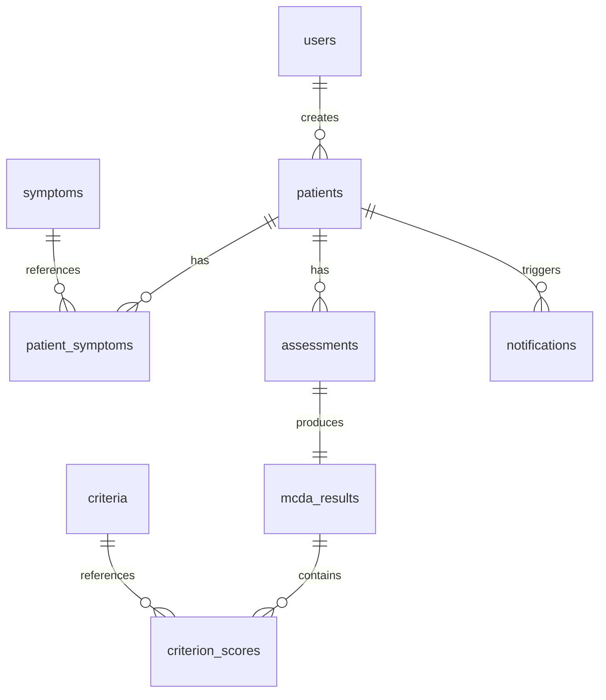

# MCDA Healthcare — Backend

Node.js / Express API for the MCDA Healthcare triage app. It stores patients in SQLite, runs weighted MCDA risk scoring on vital signs and symptoms, and serves the static frontend from the project root.

## Tech stack

| Layer | Technology |
|-------|------------|
| Runtime | Node.js (ES modules) |
| HTTP | Express 4 |
| Database | SQLite via `better-sqlite3` |
| Auth | JWT (`jsonwebtoken`) + bcrypt password hashes |
| Config | `dotenv` |

## Architecture

```mermaid
flowchart TB
  subgraph client [Client]
    FE[Static frontend]
  end

  subgraph server [Express server]
    SRV[server.js]
    AUTH_MW[auth middleware]
    AUTH_R[/api/auth]
    PAT_R[/api/patients]
    REF_R[/api/symptoms, /api/criteria]
    NOT_R[/api/notifications]
  end

  subgraph services [Services]
    PS[patientService]
    MCDA[mcdaEngine]
  end

  subgraph data [Data layer]
    DB[(SQLite mcda.db)]
    REF[reference.js]
    SEED[seed.js]
  end

  FE --> SRV
  SRV --> AUTH_R
  SRV --> PAT_R
  SRV --> REF_R
  SRV --> NOT_R
  PAT_R --> AUTH_MW
  REF_R --> AUTH_MW
  NOT_R --> AUTH_MW
  PAT_R --> PS
  NOT_R --> PS
  PS --> MCDA
  PS --> DB
  MCDA --> REF
  AUTH_R --> DB
  REF_R --> DB
  NOT_R --> DB
  SEED --> PS
  SEED --> DB
```

### Request flow (new patient)

1. Client sends `POST /api/patients` with demographics, symptoms, severities, and vitals.
2. `requireAuth` validates the JWT and attaches `req.user`.
3. `patientService.createPatientWithAssessment` runs a DB transaction:
   - inserts patient, symptoms, and assessment rows;
   - calls `mcdaEngine.runMCDA` to compute risk;
   - persists MCDA result and per-criterion scores;
   - creates a notification if risk is **Critical** or **High**.
4. The formatted patient object (with `mcdaResult`) is returned to the client.

## Project structure

```
backend/
├── src/
│   ├── server.js              # App entry, routes, static files
│   ├── middleware/
│   │   └── auth.js            # JWT verify / sign
│   ├── routes/
│   │   ├── auth.js            # Login, current user
│   │   ├── patients.js        # Patient list, detail, create
│   │   ├── reference.js       # Symptoms & criteria catalogue
│   │   └── notifications.js   # Critical-patient alerts
│   ├── services/
│   │   ├── patientService.js  # DB orchestration, API shaping
│   │   └── mcdaEngine.js      # Risk scoring algorithm
│   ├── db/
│   │   ├── database.js        # SQLite connection & schema
│   │   └── seed.js            # Demo user, reference data, patients
│   └── data/
│       └── reference.js       # Symptom/criteria definitions (in-memory)
├── data/
│   └── mcda.db                # SQLite file (created at runtime)
├── .env.example
└── package.json
```

## API reference

All protected routes expect `Authorization: Bearer <token>`.

| Method | Endpoint | Auth | Description |
|--------|----------|------|-------------|
| `GET` | `/api/health` | No | Health check |
| `POST` | `/api/auth/login` | No | Login with `{ login, password }` → JWT + user |
| `GET` | `/api/auth/me` | Yes | Current user profile |
| `GET` | `/api/patients` | Yes | All patients + dashboard stats |
| `GET` | `/api/patients/:id` | Yes | Single patient with full MCDA detail |
| `POST` | `/api/patients` | Yes | Create patient, run MCDA, return saved record |
| `GET` | `/api/symptoms` | Yes | Symptom catalogue for the form |
| `GET` | `/api/criteria` | Yes | MCDA criteria with weights |
| `GET` | `/api/notifications` | Yes | Notifications (`?unread=false` for all) |
| `PATCH` | `/api/notifications/read-all` | Yes | Mark all as read |
| `PATCH` | `/api/notifications/:id/read` | Yes | Mark one as read |

Non-API paths serve the frontend static files; unknown routes fall back to `index.html`.

## Core modules

### `middleware/auth.js`

- **`requireAuth`** — reads `Bearer` token, verifies JWT, sets `req.user`.
- **`signToken`** — issues a JWT with `id`, `login`, and `role`.

### `services/mcdaEngine.js`

Weighted-sum MCDA engine. Each vital sign is normalised to a 0–100 risk score, then multiplied by criterion weight.

| Criterion | Weight | Input |
|-----------|--------|-------|
| Blood pressure | 0.25 | Systolic value from `blood_pressure` |
| Temperature | 0.20 | °C |
| Pulse | 0.20 | bpm |
| Oxygen (SpO₂) | 0.20 | % |
| Symptoms | 0.15 | Selected symptom IDs + severity map |

**`runMCDA(patient)`** returns:

- `total_score` — weighted sum (0–100)
- `risk_level` — `Stable` \| `Low` \| `Moderate` \| `High` \| `Critical`
- `possible_diagnosis` — rule-based text from symptom combinations
- `recommendation` — structured action cards (priority, title, text)
- `ai_summary` — narrative summary for the detail view
- `criterion_scores` — per-criterion raw and weighted scores

**`riskLabel(level)`** — maps English risk level to Russian UI label.

### `services/patientService.js`

| Function | Purpose |
|----------|---------|
| `formatPatient(row)` | Builds API patient object with symptoms, assessment, and `mcdaResult` |
| `createPatientWithAssessment(data)` | Transactional create: patient → symptoms → assessment → MCDA → scores → notification |
| `getAllPatients()` | All patients, formatted for the dashboard |
| `getPatientById(id)` | Single patient or `null` |
| `getDashboardStats(patients)` | Counts `total`, `critical`, `stable`, `moderate` for dashboard cards |

### `db/database.js`

Opens `data/mcda.db`, enables WAL mode and foreign keys, and creates tables on startup:

- `users` — doctors / staff accounts
- `patients` — demographics
- `symptoms` — reference catalogue
- `patient_symptoms` — symptom + severity per patient
- `assessments` — vitals and notes per visit
- `criteria` — MCDA weights
- `mcda_results` — computed risk per assessment
- `criterion_scores` — breakdown per criterion
- `notifications` — alerts for high/critical patients

### `db/seed.js`

Idempotent seed on server start:

1. Inserts symptoms and criteria from `reference.js` if tables are empty.
2. Creates demo user `admin` / `admin` if no users exist.
3. Inserts 10 demo patients with assessments if the patients table is empty.

## Database schema (relations)



## Setup

```bash
cd backend
npm install
cp .env.example .env   # optional — defaults work for local dev
npm run dev            # or: npm start
```

Server runs at **http://localhost:3001** (or `PORT` from `.env`).

### Environment variables

| Variable | Default | Description |
|----------|---------|-------------|
| `PORT` | `3001` | HTTP port |
| `JWT_SECRET` | `mcda-dev-secret` | JWT signing secret |
| `JWT_EXPIRES_IN` | `24h` | Token lifetime |

### Demo login

| Login | Password |
|-------|----------|
| `admin` | `admin` |

## Scripts

| Command | Description |
|---------|-------------|
| `npm start` | Start server |
| `npm run dev` | Start with `--watch` (auto-restart on file changes) |
